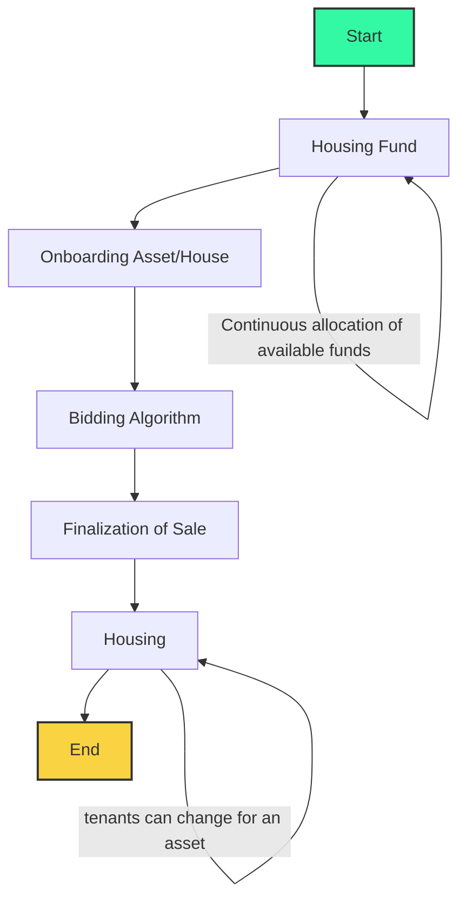

Let's try to address how Fair Squares is making housing possible in 5 steps. We are doing this in steps as we have crafted a main process that relies on each other to achieve the FS method for housing, we we require different stake holders in to participate. The steps exist because we want to have safety over the financing, onboarding and allocating houses to the stakeholders involved. In each of the steps we build on the verifications of the past steps and when one doesn't go through we fall-back or the deal is off. More about these steps we will be diving in soon. 

### Zoomed out main flow for Fair Squares housings model

This process will be repeatedly going on and is the main flow how housing 

