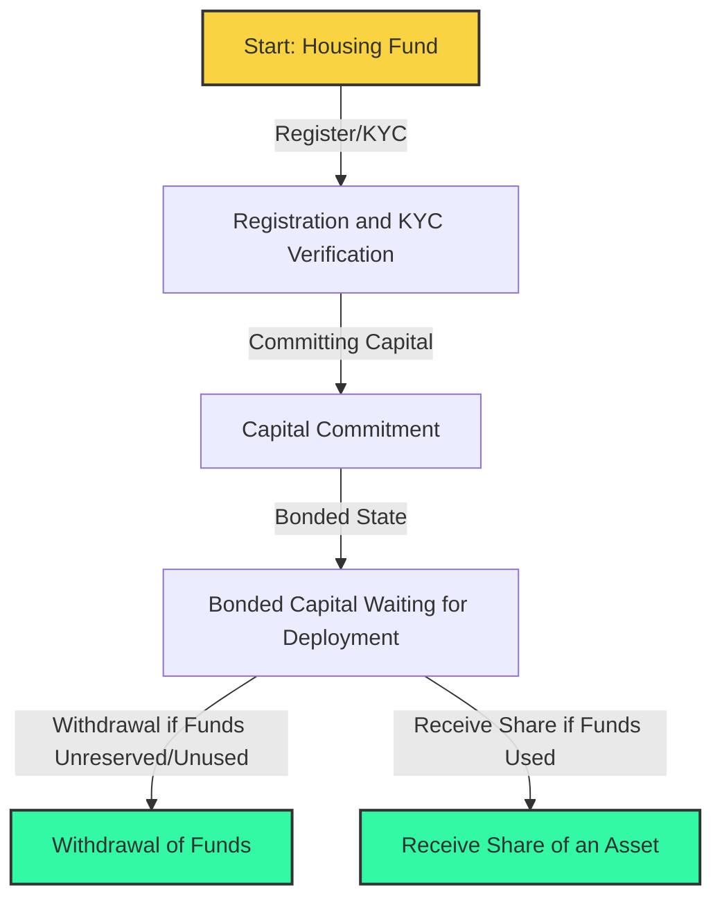

# The Housing Fund - 1

The first step in our journey towards collaborative and affordable housing involves establishing a robust **Housing Fund**. This fund plays a pivotal role in pooling resources and directing them towards investments in housing assets. 

**1. Committing capital to the housing fund**: 
Users commit their capital to the housing fund through a user-friendly platform interface. This capital is registered and the process is straightforward and secure, ensuring your funds are well-managed. It is very key the users know beforehand what they are getting into, hence we do need users to be fully aware of the further mechanics. 

**2. Registration**:
The housing fund successfully registers the amount if the user is verified and has the investor role. It registers also when the user has committed it's capital this will be used for the bidding algorithm to apply a first-come-first-served 

**3. Bonded state:**
Once a user has bonded their capital to the housing fund, they don't really have to do much, but we do rely on their further participation in step. 2 to vote over asset onboarding. 
 
**4. Withdrawal of funds:**
A user can always withdraw their funds from the housing fund if the funds are unreserved and not allocated yet for purchasing an asset directly. Or indirectly they can make the housing fund know that they would not like to participate further.

The housing fund is pretty simple and is just a  pot of resources that it keeps track of and deploys the required funds if it has permission from the protocol which is directed by the community for further actions. 

### Requirements:
1. Have a verified identity through partners, something like [this](https://www2.deloitte.com/ch/en/pages/press-releases/articles/deloitte-integrates-kilt-identity-blockchain-creating-new-markets-with-reusable-digital-credentials.html). 
2. Have a the minimal amount of investment capital ready (1000 EUR or USD). This is implemented so people with a minimum can be taken along in the investment of an asset, so it's doesn't become to costly for the operating system to exclude them. Their will be no maximum as the next steps you will see implemented that we don't want  majority shares in assets, so users allocation will be dealt with. 
3. Investment is done in a stable token / fiat.
4. We do require users to understand the mechanics of Fair Squares since it's built for a collective decision making to support affordable housing. This means if the user has deposited it's funds the overall decision making of the collective will decide what happens with the funds. This might seem dangerous, but we do aim to deploy this in a very tight way at first and then decide on further relinquishing control to the community. 

### Characteristics:

- **Fair Allocation**: Every user's investment is allocated in a transparent and fair manner. We believe in openness and equality in investment opportunities.
- **Investment Returns**: Investors receive returns proportional to their investment. The fund aims to acquire housing assets, and the returns are fractionalized, ensuring everyone gets a fair share of the earnings pro-rata over your investment.
- **Open Account Policy**: The fund operates on an open account basis, welcoming anyone interested in making a positive impact in the housing sector or willing to invest in something completely transparent and managed transparently. 
- **Investment in Collaboration**: By investing in the fund, you become part of a larger community focused on making housing more accessible and affordable. 
- **Asset Purchasing and Management**: The fund is used for purchasing and managing housing assets, ensuring that your investment is put to good use.

---