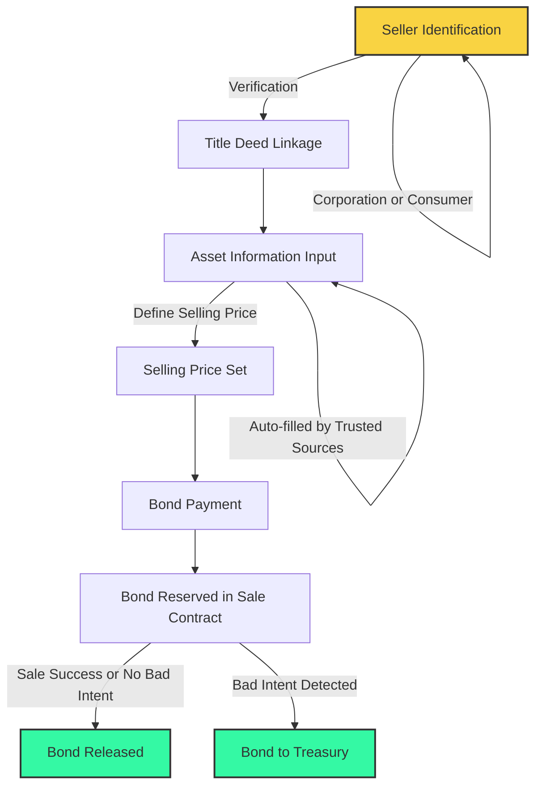
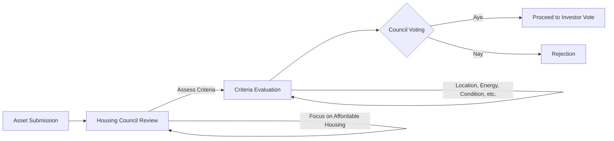
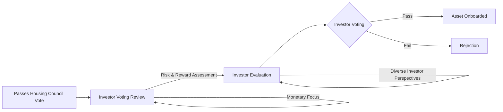

# Asset Onboarding (2)

Following the Housing Fund, the next step is **Asset Onboarding**. This process involves safely onboarding properties into Fair Squares. It's developed to  onboard assets that the majority of stake holders of the protocol want. It's a crucial phase where assets become part of the protocol and we require governance participation on which asset that will be. We require stake-holders to discuss and proof why a certain assets fits within the Fair Squares protocol. There will be a mandate from the DAO to optimize good affordable houses in urban areas. We need people to judge on those values since only those specific assets will advance the mission of the FS community. 

### Characteristics of the onboarding process

- **Open to all**: We don't want just institutions or corporations to have be able to onboard assets. The goal is to create a system where consumers are be able to sell their asset. This opens up a complete different trust level as users might assume retail as less trustworthy as they don't have the reputation to lose as companies have. We have clear safety checks to disincentive cheating, while it's still easy for users to sell on the Fair Squares DAO. 

- **Strong Identification Required**: To ensure legitimacy, we require concrete proof of ownership, such as title deeds or house registries. This step is crucial for maintaining trust and transparency and this would be done within the identity verification process when someone registers as a **seller** to have proof of ownership.  

- **Bond Deposit**: When onboarding an asset, users are required to bond a smaller  percentage of the asset's value (0.2% of the house's sale price). This acts as a security deposit against any potential misconduct. If the sale fails or succeeds and no bad intent was shown, the seller with get this back.

- **Pricing Authority**: Sellers have the autonomy to set the price. However, it's important to balance between desired and market value. Overpricing may lead to rejection in later stages, along with a minor fee for wasted time and resources. The seller can follow the arguments from the decision making process and can adjust it's price after an initial failure for a successful onboarding if the asset fitted within the FS criteria. 

## Governance in Asset Onboarding

The onboarding process is governed by two main bodies, once there is an asset that is trying to be onboarded the following governance bodies will start deciding if this asset should be onboarded. In the following two paragraphs we unfold how the two governance bodies onboard an asset and what their motives are. 

### The Housing Council

**Role**: The Housing Council, composed of publicly elected individuals or organizations play a pivotal role. The are the first line where an asset passes through. Their focus is to achieve an affordable housing environment with the right variables, that come from different background and want to further advance the Fair Squares DAO. This vision will be further backed by a handbook where the focus of the DAO is.

**Criteria considered by the housing council**:
  - Location of an asset, urban areas preferred might be preferred as this is where most of the increased house prices exsist. 
  - Energy efficiency, it's good to have a 
  - Condition of the property (good or bad state)
  - Additional factors relevant to housing quality (environment, accessibility)
  - Taxation report and technical. 

  The council is not expected to find out every bit of the asset, the main goal is to find out if it's fits within the search bandwidth of the asset in the Fair Squares community and if the house would be plenty of demand. IF the guidelines up are followed through this will be the case. 

**Decision**:  Council members vote 'Aye' or 'Nay' on each housing proposal. Their decision influences whether an asset progresses to the next stage which is the investors vote. 

### Investors vote

Comes after the housing council vote if it passes and they decide on the final step if an asset get's onboarded. They differ from the housing council as they are the users that have put up the capital on Fair Squares to invest already in and are using now their voting rights to further decide if an asset should be onboarded on Fair Squares. 

**Role**: The expectation of an investor is to look at an asset from the pov of risk and reward. A real estate investor can look from different angles than the housing council will look at it and they decide. We goal is to let any investor invest and participate in the vote who has the role of an investor. We want investors to look at the monetary side mainly since the housing council will have judged it on the housing quality and right fit for the values of assets we are looking for in the DAO. The crucial part that makes the difference in this vote is that no investors know's with certainty upfront their capital will be used to pay for the onboarded asset. 

**Voting Threshold**: Is not fully fleshed out how we expect to advance with the investors vote. We are aiming not to give the people with more capital more voting rights since it may lead to unfavourable voting standards, but also we don't aim to implement something that passes too hard or easy. We can learn many lessons from the [OpenGov tracks](https://wiki.polkadot.network/docs/learn-polkadot-opengov-origins#root) and implement similar voting standards for the investors vote, but this is still in research phase. 

**Decision**: If the asset passes this voting stage, it gains the status of **onboarded**, ready to advance to the next step in the process, which is the bidding phase and is dealt with just in the runtime. This is why onboarding assets is crucial and we need two governance bodies to onboard an asset. 

## Conclusion

Asset Onboarding process is a key step in ensuring that only the best and most suitable properties make it through the platform. This step maintains the integrity and value of our community while ensure we have assets available for potential tenants. 

By incorporating thorough evaluations by the Housing Council and investor votes, it ensures that only properties meeting the highest standards are selected. This dual-governance approach balances the needs for housing quality with financial viability, maintaining the integrity of investments and aligning with the DAO's mission for accessible housing. Through this rigorous process, Fair Squares maintains its commitment to offering valuable and affordable assets to its community.
