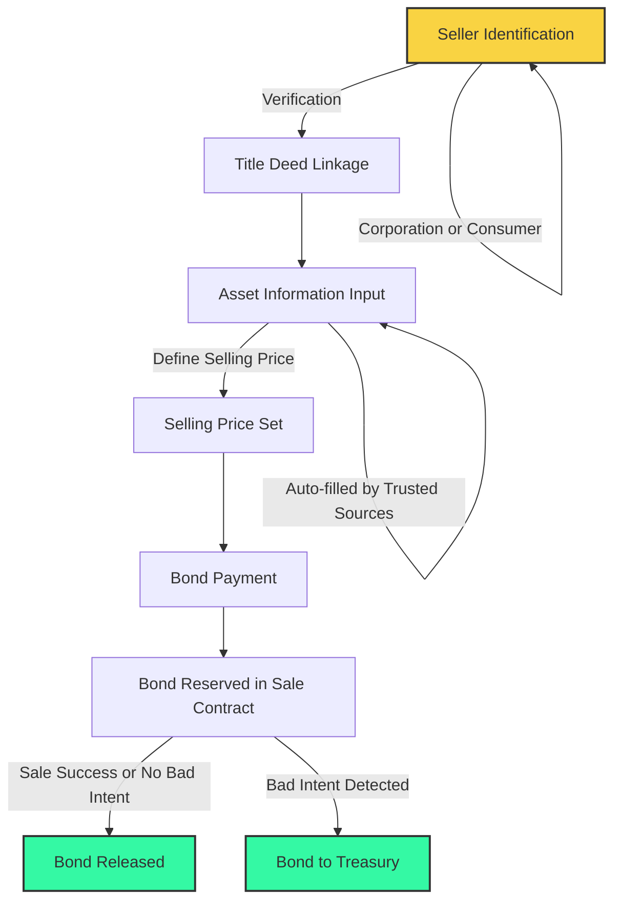
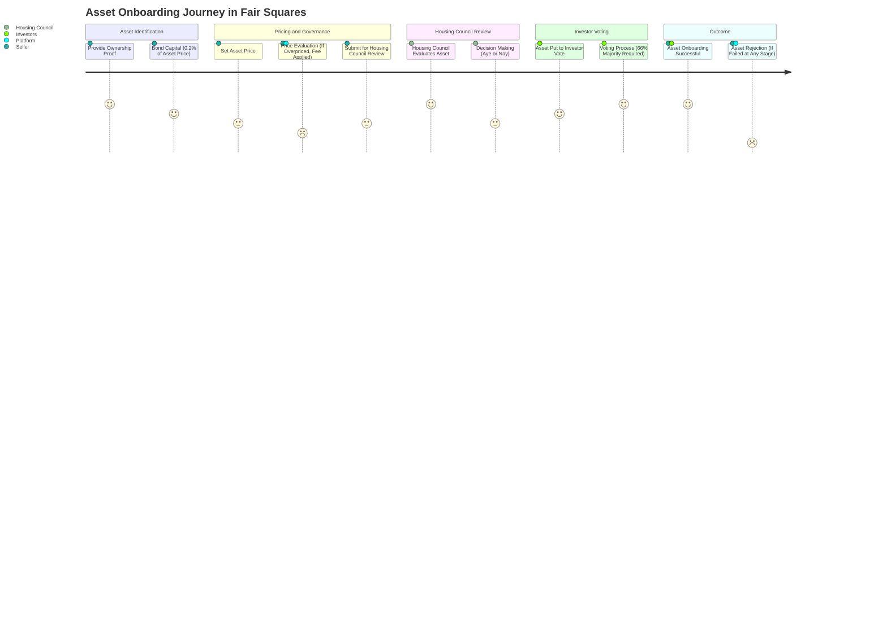

# Asset Onboarding (2)

Following the Housing Fund, the next step is **Asset Onboarding**. This process involves safely onboarding properties into Fair Squares. It's developed to  onboard assets that the majority of stake holders of the protocol want. It's a crucial phase where assets become part of the protocol and we require governance participation on which asset that will be. We require stake-holders to discuss and proof why a certain assets fits within the Fair Squares protocol. There will be a mandate from the DAO to optimize good affordable houses in urban areas. We need people to judge on those values since only those specific assets will advance the mission of the FS community. 

### Characteristics of the onboarding process

- **Open to all**: We don't want just institutions or corporations to have be able to onboard assets. The goal is to create a system where consumers are be able to sell their asset. This opens up a complete different trust level as users might assume retail as less trustworthy as they don't have the reputation to lose as companies have. We have clear safety checks to disincentive cheating, while it's still easy for users to sell on the Fair Squares DAO. 

- **Strong Identification Required**: To ensure legitimacy, we require concrete proof of ownership, such as title deeds or house registries. This step is crucial for maintaining trust and transparency and this would be done within the identity verification process when someone registers as a **seller** to have proof of ownership.  

- **Bond Deposit**: When onboarding an asset, users are required to bond a smaller  percentage of the asset's value (0.2% of the house's sale price). This acts as a security deposit against any potential misconduct. If the sale fails or succeeds and no bad intent was shown, the seller with get this back.

- **Pricing Authority**: Sellers have the autonomy to set the price. However, it's important to balance between desired and market value. Overpricing may lead to rejection in later stages, along with a minor fee for wasted time and resources. The seller can follow the arguments from the decision making process and can adjust it's price after an initial failure for a successful onboarding if the asset fitted within the FS criteria. 

### Governance in Asset Onboarding

The onboarding process is governed by two main bodies. It starts with the housing council and from there on it goes on to the investor voting. 

#### The Housing Council

- **Role**: The Housing Council, composed of publicly elected individuals or organizations, plays a pivotal role. They focus on affordable housing and assess whether the asset meets specific criteria.

- **Criteria Considered**:
  - Location (urban areas preferred)
  - Energy efficiency 
  - Condition of the property (good or bad state)
  - Additional factors relevant to housing quality
  - Complete history of maintenance

- **Decision Making**:  Council members vote 'Aye' or 'Nay' on each housing proposal. Their decision influences whether an asset progresses to the next stage.

### Investor Voting

- **Participant's Role**: Investors who have bonded their money in the Housing Fund also get a say. Their vote is crucial as they are potential future co-owners of these assets.

- **Voting Threshold**: For an asset to be successfully onboarded, it must receive a majority vote of 66% from the investors.

- **Outcome**: If the asset passes this voting stage, it gains the status of 'Onboarded', ready to advance to the next step in the process.

## Conclusion

Asset Onboarding is a key step in ensuring that only the best and most suitable properties make it through our platform. This step maintains the integrity and value of our investments, ensuring that every asset we deal with meets our high standards for quality and affordability.

## Diagram

---

*Note: This is page 2 of the "Fair Squares in 5 Steps" series.*
