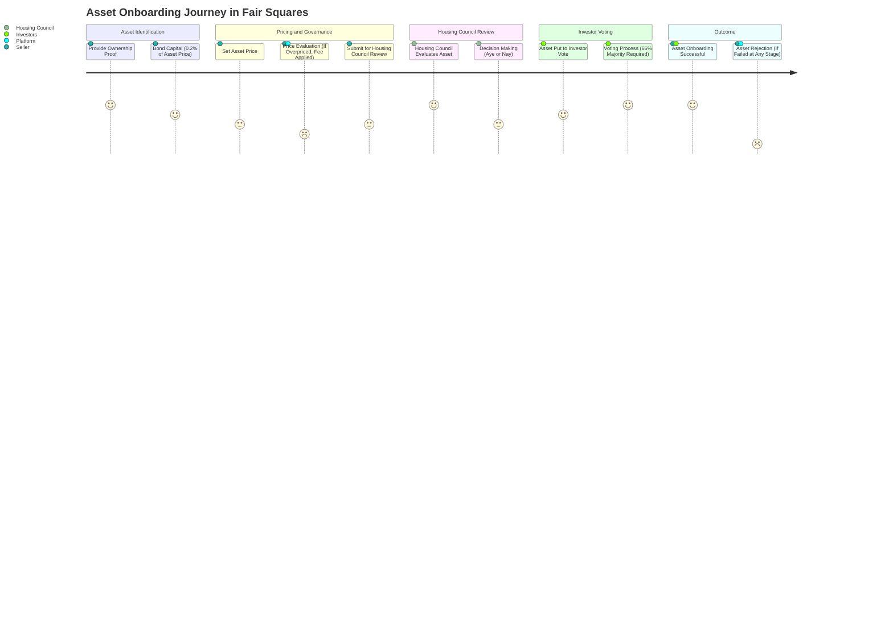

# Fair Squares in 5 Steps: Step 2 - Asset Onboarding

## Introduction to Asset Onboarding

Following the establishment of the Housing Fund, the next vital step is **Asset Onboarding**. This process involves safely introducing properties into our platform, ready for investment and decision-making. It's a crucial phase where assets become part of our transformative housing journey.

## The Onboarding Process

Asset onboarding at Fair Squares is a structured and secure process. Here's how it unfolds:

- **Open to All**: Both institutional and retail individuals can onboard assets. We welcome a diverse range of participants to our platform.

- **Strong Identification Required**: To ensure legitimacy, we require concrete proof of ownership, such as title deeds or house registries. This step is crucial for maintaining trust and transparency.

- **Capital Bonding**: When onboarding an asset, users are required to bond a small percentage of the asset's value (0.2% of the house's sale price). This acts as a security deposit against any potential misconduct.

- **Pricing Authority**: Sellers have the autonomy to set the price. However, it's important to balance between desired and market value. Overpricing may lead to rejection in later stages, along with a minor fee for wasted time and resources.

## Governance in Asset Onboarding

The onboarding process is governed by two main bodies:

### The Housing Council

- **Role**: The Housing Council, composed of publicly elected individuals or organizations, plays a pivotal role. They focus on affordable housing and assess whether the asset meets specific criteria.

- **Criteria Considered**:
  - Location (urban areas preferred)
  - Energy efficiency
  - Condition of the property (good or bad state)
  - Additional factors relevant to housing quality

- **Decision Making**: Council members vote 'Aye' or 'Nay' on each housing proposal. Their decision influences whether an asset progresses to the next stage.

### Investor Voting

- **Participant's Role**: Investors who have bonded their money in the Housing Fund also get a say. Their vote is crucial as they are potential future co-owners of these assets.

- **Voting Threshold**: For an asset to be successfully onboarded, it must receive a majority vote of 66% from the investors.

- **Outcome**: If the asset passes this voting stage, it gains the status of 'Onboarded', ready to advance to the next step in the process.

## Conclusion

Asset Onboarding is a key step in ensuring that only the best and most suitable properties make it through our platform. This step maintains the integrity and value of our investments, ensuring that every asset we deal with meets our high standards for quality and affordability.

## Diagram

---

*Note: This is page 2 of the "Fair Squares in 5 Steps" series.*
