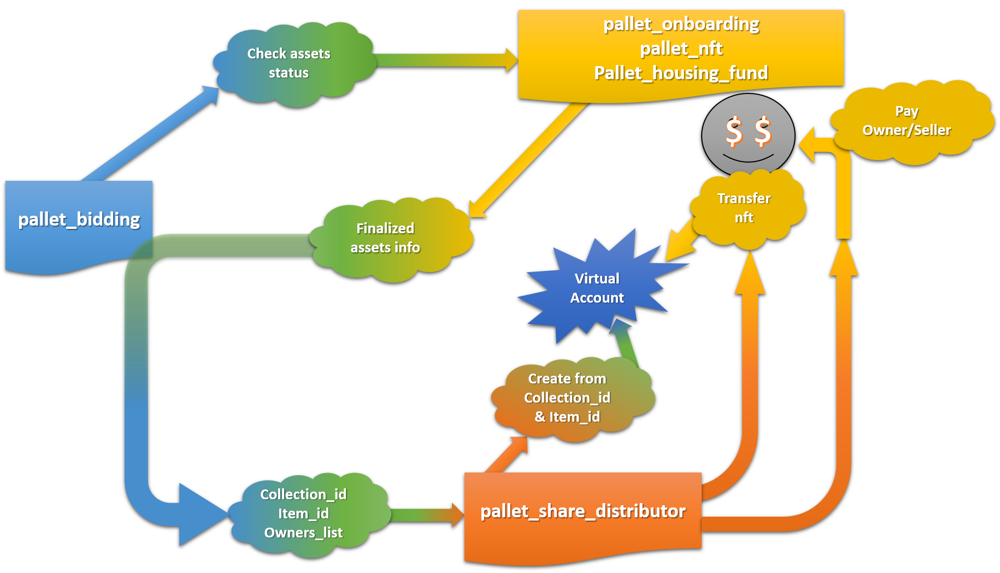

# Fair Squares Design & Architecture

This section explains the mechanics of each Fair Squares pallet and runtime. A scenario derived from the testing guide is used to make the explanation easier to understand.
** The descriptions given reflect the current stage of development, and will be subject to changes in the future.**
The focus will be on user experience and future investors, for this reason, some technical aspects might be ignored.

import TOCInline from '@theme/TOCInline';

<TOCInline toc={toc} />

## 1) Characters

The roles are distributed as follows: 1 Servicer, 1 Seller, 1 Notary, 1 Representative applicant, 2 dummy Representatives (set by default), 2 Tenant applicants, and 8 Investors. For more details on each character, see _Table 1_ below.

| Name         | Role                                  | Contribution to the Fair Squares Fund |
| ------------ | ------------------------------------- | ------------------------------------- |
| Alice        | Servicer/Council_member/Administrator | None                                  |
| Bob          | Seller/Council_member                 | None                                  |
| Charlie      | Notary/Council_member                 | None                                  |
| Dave         | Representative (Applicant)            | None                                  |
| Henry        | Representative (No Asset)             | None                                  |
| Gabriel      | Representative (No Asset)             | None                                  |
| Eve          | Tenant (Applicant)                    | None                                  |
| Ferdie       | Tenant (Applicant)                    | None                                  |
| KillMonger   | Investor                              | $6,000,000                            |
| Aluman       | Investor                              | $9,000,000                            |
| Shikamaru    | Investor                              | $3,500,000                            |
| Geraldo      | Investor                              | $8,000,000                            |
| Obito        | Investor                              | $5,000,000                            |
| Hans         | Investor                              | $7,000,000                            |
| Alice//stash | Investor                              | $3,000,000                            |
| Bob//stash   | Investor                              | $2,000,000                            |

_Table 1: Description of the different characters._

## 2) Roles Pallet

The first step in the workflow is to set roles using the `Roles` pallet. Users use the `set_role` function to apply to the role they want:

- **Investors** & **Tenants** get the role right away.
- **Seller**/**Notary**/**Servicer**/**Representative**

  They need to go through an approval that varies with the requested role. Their request is therefore sent to a waiting list first.

- **Administrator** & **Council member** are attributed by default and are not completely managed by the `Roles` pallet.

  We will refer to them as special roles, and other roles will be referred to as standard roles. In a production environment, these will be appointed with governance. Each user can only have one standard role.

- The maximum number of roles that can be attributed is currently fixed at 200.

- Alice, as the platform administrator, possesses the **Servicer** role by default.

  As a servicer, her role is to **review**, **approve** or **reject** **Seller**, **Servicer** and **Notary** role requests by using the `account_approval` and/or `account_rejection` functions.

  She can also transfer her **Administrator** role to someone else (she will then lose it) by using the `set_manager` function.

In _Table 2_, we give an overview of the information & actions linked to each role. The **Available actions** section of this table will be updated for each pallet:

<table>
  <tr>
   <td>
   </td>
   <td>Servicer</td>
   <td>Seller</td>
   <td>Notary</td>
   <td>Representative</td>
   <td>Investor</td>
   <td>Tenant</td>
  </tr>
  <tr>
   <td colspan="7" ><b>Available Fields/Information</b></td>
  </tr>
  <tr>
   <td>account_id</td>
   <td>◎</td>
   <td>◎</td>
   <td>◎</td>
   <td>◎</td>
   <td>◎</td>
   <td>◎</td>
  </tr>
  <tr>
   <td>age</td>
   <td>◎</td>
   <td>◎</td>
   <td>◎</td>
   <td>◎</td>
   <td>◎</td>
   <td>◎</td>
  </tr>
  <tr>
   <td>activated</td>
   <td>◎</td>
   <td>◎</td>
   <td>◎</td>
   <td>◎</td>
   <td>✖</td>
   <td>✖</td>
  </tr>
  <tr>
   <td>verifier</td>
   <td>◎</td>
   <td>◎</td>
   <td>◎</td>
   <td>✖</td>
   <td>✖</td>
   <td>✖</td>
  </tr>
  <tr>
   <td>assets_accounts</td>
   <td>✖</td>
   <td>✖</td>
   <td>✖</td>
   <td>◎</td>
   <td>◎</td>
   <td>◎</td>
  </tr>
  <tr>
   <td>rent</td>
   <td>✖</td>
   <td>✖</td>
   <td>✖</td>
   <td>✖</td>
   <td>✖</td>
   <td>◎</td>
  </tr>
  <tr>
   <td colspan="7" ><b>Available Actions</b></td>
  </tr>
  <tr>
   <td>Approve/Reject  a role request</td>
   <td>◎</td>
   <td>✖</td>
   <td>✖</td>
   <td>✖</td>
   <td>✖</td>
   <td>✖</td>
  </tr>
  <tr>
   <td>Set a role</td>
   <td>◎</td>
   <td>◎</td>
   <td>◎</td>
   <td>◎</td>
   <td>◎</td>
   <td>◎</td>
  </tr>
  <tr>
   <td>Waiting List</td>
   <td>◎</td>
   <td>◎</td>
   <td>◎</td>
   <td>◎</td>
   <td>✖</td>
   <td>✖</td>
  </tr>
</table>

_Table 2: Available Information and actions for each role in the **Roles** pallet._

Finally, according to the rules described so far, users request and receive their roles, in order to reach the distribution shown in _Table 1_.

Time to move to the next pallet: **Housing Fund**.

## 3) Housing Fund Pallet

In the second step, investors use the **Housing Fund** pallet to contribute to assets.

<table>
<tbody>
<tr>
<td>&nbsp;</td>
<td>Servicer</td>
<td>Seller</td>
<td>Notary</td>
<td>Representative</td>
<td>Investor</td>
<td>Tenant</td>
</tr>
<tr>
<td colspan="7"><b>Available Fields/Information</b></td>
</tr>
<tr>
<td>account_id</td>
<td>◎</td>
<td>◎</td>
<td>◎</td>
<td>◎</td>
<td>◎</td>
<td>◎</td>
</tr>
<tr>
<td>age</td>
<td>◎</td>
<td>◎</td>
<td>◎</td>
<td>◎</td>
<td>◎</td>
<td>◎</td>
</tr>
<tr>
<td>activated</td>
<td>◎</td>
<td>◎</td>
<td>◎</td>
<td>◎</td>
<td>✖</td>
<td>✖</td>
</tr>
<tr>
<td>verifier</td>
<td>◎</td>
<td>◎</td>
<td>◎</td>
<td>✖</td>
<td>✖</td>
<td>✖</td>
</tr>
<tr>
<td>assets_accounts</td>
<td>✖</td>
<td>✖</td>
<td>✖</td>
<td>◎</td>
<td>◎</td>
<td>◎</td>
</tr>
<tr>
<td>rent</td>
<td>✖</td>
<td>✖</td>
<td>✖</td>
<td>✖</td>
<td>✖</td>
<td>◎</td>
</tr>
<tr>
<td colspan="7"><b>Available Actions</b></td>
</tr>
<tr>
<td>Contribute to the fund</td>
<td>✖</td>
<td>✖</td>
<td>✖</td>
<td>✖</td>
<td>◎</td>
<td>✖</td>
</tr>
<tr>
<td>Withdraw from the fund</td>
<td>✖</td>
<td>✖</td>
<td>✖</td>
<td>✖</td>
<td>◎</td>
<td>✖</td>
</tr>
</tbody>
</table>

_Table 3: Available Information and actions for each role in the **Housing Fund** pallet._

The following conditions apply to fund contribution:

- Minimum contribution of $5000.
- Maximum Contribution of $20,000 (Not in use at the moment).
- Fund Threshold of $100,000 (Not in use at the moment).

All information relative to fund contributions are stored in the **Housing Fund** pallet, and are available for other pallets to use. For this reason, the **Housing Fund** pallet, as well as the **Roles** pallet will be mentioned in the explanation of several other pallets.

## 4) Onboarding Pallet & NFT Pallet

Onboarding & NFT pallets are tightly coupled pallets and it would be very difficult to explain the contents of one without the other.

Now that we have money in the housing fund, Bob the **Seller** will create a proposal using the **Onboarding** Pallet. This pallet is tightly coupled with the **NFT** pallet, and allows **Seller**s to fulfill the following tasks:

#### _a) Create an asset sale proposal_

Here, through the use of the `create_and_submit_proposal` the Seller selects between different classes of assets (Houses, Apartment complex, Offices, etc...) provided by the NFT pallet, and defines the price, name, additional information describing the asset (metadata), before creating it. The **NFT** pallet is then used to create an asset sale proposal that will be transferred to the **Voting** pallet if submitted by the seller/NFT minter.

Only **Seller**s have the authority to create an asset.

In the background, an NFT is minted at asset creation by the **NFT** pallet (in other words the seller has authority on minting a new NFT), using the information provided by the seller. This NFT is also given an ID connected to its asset class. Submitting the asset or not after creation is among the choices offered to the seller, as a modifiable parameter.

#### _b) Modify asset specifications before submission_

It is possible to create an asset, without immediately submitting it for a review by the **House Council** (see the **Voting** pallet). In this case, the seller might want to modify the asset’s metadata, or add it: the right to set/modify data is also defined in the **NFT** pallet and is provided to **Seller**s.

After creation, the asset can be submitted for review to the **House Council**, before being transferred to **Investor**s for a vote (**Voting** pallet).

The **Onboarding** pallet also introduces the concept of an assets status (**EDITING**, **REVIEWING**, **ONBOARDED**, **FINALIZING**, **FINALIZED**, **REJECTED**), which describes the location of the asset in the **Fair Squares** workflow.

<table>
<tbody>
<tr>
<td>&nbsp;</td>
<td>Servicer</td>
<td>Seller</td>
<td>Notary</td>
<td>Representative</td>
<td>Investor</td>
<td>Tenant</td>
</tr>
<tr>
<td colspan="7"><b>Available Fields/Information</b></td>
</tr>
<tr>
<td>account_id</td>
<td>◎</td>
<td>◎</td>
<td>◎</td>
<td>◎</td>
<td>◎</td>
<td>◎</td>
</tr>
<tr>
<td>age</td>
<td>◎</td>
<td>◎</td>
<td>◎</td>
<td>◎</td>
<td>◎</td>
<td>◎</td>
</tr>
<tr>
<td>activated</td>
<td>◎</td>
<td>◎</td>
<td>◎</td>
<td>◎</td>
<td>✖</td>
<td>✖</td>
</tr>
<tr>
<td>verifier</td>
<td>◎</td>
<td>◎</td>
<td>◎</td>
<td>✖</td>
<td>✖</td>
<td>✖</td>
</tr>
<tr>
<td>assets_accounts</td>
<td>✖</td>
<td>✖</td>
<td>✖</td>
<td>◎</td>
<td>◎</td>
<td>◎</td>
</tr>
<tr>
<td>rent</td>
<td>✖</td>
<td>✖</td>
<td>✖</td>
<td>✖</td>
<td>✖</td>
<td>◎</td>
</tr>
<tr>
<td colspan="7"><b>Available Actions</b></td>
</tr>
<tr>
<td>create_and_submit_proposal</td>
<td>✖</td>
<td>◎</td>
<td>✖</td>
<td>✖</td>
<td>✖</td>
<td>✖</td>
</tr>
<tr>
<td>submit_awaiting</td>
<td>✖</td>
<td>◎</td>
<td>✖</td>
<td>✖</td>
<td>✖</td>
<td>✖</td>
</tr>
<tr>
<td>reject_edit</td>
<td>◎</td>
<td>✖</td>
<td>✖</td>
<td>✖</td>
<td>✖</td>
<td>✖</td>
</tr>
<tr>
<td>reject_destroy</td>
<td>◎</td>
<td>✖</td>
<td>✖</td>
<td>✖</td>
<td>✖</td>
<td>✖</td>
</tr>
<tr>
<td>change_status</td>
<td>◎</td>
<td>✖</td>
<td>✖</td>
<td>✖</td>
<td>✖</td>
<td>✖</td>
</tr>
</tbody>
</table>

_Table 4: Available Information and actions for each role in the **Onboarding** pallet._

You can also see in _Table 4_ that the **Onboarding** pallet allows a **servicer** to reject an asset proposal for editing or destruction, depending on the case at hand. From the **NFT** pallet side, this means editing the NFT’s metadata, or burning the NFT. Some of the main functions of the **NFT** pallet are shown in _Table 5_.

Creation & submission of a proposal is not free of charge for the **Seller**: a proposal fee, which represents 10% of the asset price (configurable), is reserved at creation of the proposal, and slashed if the proposal is destroyed. If rejected for editing, only 10% of the reserved fees are slashed, and if accepted, remaining reserved fees are returned.

<table>
<tbody>
<tr>
<td>&nbsp;</td>
<td>Servicer</td>
<td>Seller</td>
<td>Notary</td>
<td>Representative</td>
<td>Investor</td>
<td>Tenant</td>
</tr>
<tr>
<td colspan="7"><b>Available Fields/Information</b></td>
</tr>
<tr>
<td>account_id</td>
<td>◎</td>
<td>◎</td>
<td>◎</td>
<td>◎</td>
<td>◎</td>
<td>◎</td>
</tr>
<tr>
<td>age</td>
<td>◎</td>
<td>◎</td>
<td>◎</td>
<td>◎</td>
<td>◎</td>
<td>◎</td>
</tr>
<tr>
<td>activated</td>
<td>◎</td>
<td>◎</td>
<td>◎</td>
<td>◎</td>
<td>✖</td>
<td>✖</td>
</tr>
<tr>
<td>verifier</td>
<td>◎</td>
<td>◎</td>
<td>◎</td>
<td>✖</td>
<td>✖</td>
<td>✖</td>
</tr>
<tr>
<td>assets_accounts</td>
<td>✖</td>
<td>✖</td>
<td>✖</td>
<td>◎</td>
<td>◎</td>
<td>◎</td>
</tr>
<tr>
<td>rent</td>
<td>✖</td>
<td>✖</td>
<td>✖</td>
<td>✖</td>
<td>✖</td>
<td>◎</td>
</tr>
<tr>
<td colspan="7"><b>Available Actions</b></td>
</tr>
<tr>
<td>create_collection</td>
<td>◎</td>
<td>✖</td>
<td>✖</td>
<td>✖</td>
<td>✖</td>
<td>✖</td>
</tr>
<tr>
<td>mint</td>
<td>✖</td>
<td>◎</td>
<td>✖</td>
<td>✖</td>
<td>✖</td>
<td>✖</td>
</tr>
<tr>
<td>transfer*</td>
<td>◎</td>
<td>✖</td>
<td>✖</td>
<td>✖</td>
<td>✖</td>
<td>✖</td>
</tr>
<tr>
<td>burn</td>
<td>◎</td>
<td>✖</td>
<td>✖</td>
<td>✖</td>
<td>✖</td>
<td>✖</td>
</tr>
<tr>
<td>destroy_collection</td>
<td>◎</td>
<td>✖</td>
<td>✖</td>
<td>✖</td>
<td>✖</td>
<td>✖</td>
</tr>
</tbody>
</table>

_Table 5: Available Information and actions for each role in the NFT pallet._

## 5) Voting pallet

This is the governance system used to decide if an asset is valid for purchase or not. It is composed of two phases:

- The council conducts the first review of an asset proposal created by a **Seller**, in order to spot any irregularities, and conducts a vote.

  Composition of the council still has to be clarified (real estate professional, lawyer, community members, Fair Squares team members, etc.). At this stage, the asset might be rejected for editing if a minor compliance problem is detected, or rejected for destruction, if the asset specifications, or the Seller are in violation of the terms of **Fair Squares** platform.

- If approved by the council, the asset’s proposal is transferred to an Investors' vote session. Investors decide through a vote if they want their **Fair Squares** fund to invest in this asset, and eventually become one of the co-owners (if selected by the FS algorithm) of this asset.

A summary of the proposal submission workflow is shown in _Figure 1_ below.

_Figure 1 - Proposal submission workflow. This workflow only shows the tasks performed by the **NFT**, **Onboarding**, and **Voting** pallets._

## 6) Bidding pallet

The **Bidding** pallet regularly scans the chain, looking for **ONBOARDED** assets, and executes the following tasks when one is found:

- Check that the **Housing Fund** has enough funds to buy the asset.
- Generate a list of investors for the asset.

Generating a list of investors is a core functionality of **Fair Squares**, and is obeying the following conditions (configurable):

- The maximum asset share per investor is 40%
- The minimum asset share per investor is 5%

Through the use of a **First Come First Serve** principle, the bidding pallet creates an owners list as described in _Table 6_ below:

|  INVESTORS   | Contribution age (in blocks) | Contribution to the fund | INVESTOR Share in the Housing Fund (%) |
| :----------: | :--------------------------: | :----------------------: | :------------------------------------: |
|  KillMonger  |              55              |      $6,000,000.00       |                  13.8                  |
|    Aluman    |              54              |      $9,000,000.00       |                  20.7                  |
|  Shikamaru   |              53              |      $3,500,000.00       |                  8.0                   |
|   Geraldo    |              52              |      $8,000,000.00       |                  18.4                  |
|    Obito     |              51              |      $5,000,000.00       |                  11.5                  |
|     Hans     |              50              |      $7,000,000.00       |                  16.1                  |
| Alice//stash |              49              |      $3,000,000.00       |                  6.9                   |
|  Bob//stash  |              48              |      $2,000,000.00       |                  4.6                   |

_Table 6: shares & contributions._

In this example, we will consider an asset with a price of 10 million US dollars. _Table 7_ shows a brief recap of the scenario's general configuration :

|                 | USD         | %   |
| --------------- | ----------- | --- |
| Housing Fund    | $43,500,000 | -   |
| Asset price     | $10,000,000 | 100 |
| Min Asset share | $500,000    | 5   |
| Max Asset share | $4,000,000  | 40  |

_Table 7: Scenario's setting._

The following criteria are used to organize investors who will become future owners of an asset:

1. Oldest contribution has higher priority
2. In order to get a list of eligible investors, temporary shares are attributed as below:

- If the investor’s invested amount in the housing fund is greater than maximum authorized contribution to a purchase, maximum contribution is selected (40% of the purchase price)
- If the investor's invested amount in the housing fund is in the normal range (between 5% & 40% of the purchase price), then the share is calculated as a percentage of the purchase price.

|  INVESTORS   | contribution Age (in blocks) | Contribution to the fund | Temporary share (%) |
| :----------: | :--------------------------: | :----------------------: | :-----------------: |
|  KillMonger  |              55              |      $6,000,000.00       |         40          |
|    Aluman    |              54              |      $9,000,000.00       |         40          |
|  Shikamaru   |              53              |      $3,500,000.00       |         35          |
|   Geraldo    |              52              |      $8,000,000.00       |         40          |
|    Obito     |              51              |      $5,000,000.00       |         40          |
|     Hans     |              50              |      $7,000,000.00       |         40          |
| Alice//stash |              49              |      $3,000,000.00       |         30          |
|  Bob//stash  |              48              |      $2,000,000.00       |         20          |

_Table 8: Temporary asset share distribution._

The next step explains how the Eligible investors list is used to distribute the asset among the investors. In this new scenario, Mr. A already received his asset share (x0_final). Other members still have temporary shares, and the diagram below explains the process used to determine Mr. B final share (x1_final). Y is the total asset share: 100%.

_Figure 2 - Final Asset share calculation process._

The same process is used for Mr. C share calculation. In the case of Mr. C however, instead of (Y-x0_final) in check no. 1, we will use: (Y - x0_final - x1_final), as we want the remaining asset share after distribution to Mr. B when doing the different checks.

## 7) Finalizer Pallet

**Onboarded** assets still need to go through a final round of scrutiny before being considered valid for `purchase`.
Throughout the **Finalizer** pallet, a _Notary_ receives **Onboarded** assets information from the **Bidding** pallet, 
and conducts a deeper off-chain legal investigation: the asset's status then changes from **Onboarded** to **Finalising**. 
Assets accepted by the _Notary_ receive the status **Finalised**, while others are **Rejected**.

## 8) Share Distributor pallet

Once an asset has the status **Finalised**, the **Bidding** pallet will first use the **Share Distributor** pallet to create a virtual account connected to the new owners. This virtual will store the NFT created earlier during asset submission by the seller. Once  it is confirmed that the Nft corresponding to this asset, was transfered from the Seller to the virtual account/asset owners, the seller account finally receives the payment due for the asset purchase. 

_Figure 2 - Share Distributor flow part.1: Creation of a virtual account to store the asset NFT_

In the second task of the **Share_Distributor** pallet, the virtual account mints 1000 ownership tokens specific to the asset. These tokens will
be distributed to the owners according to their contribution to the asset purchase: a 20% contribution will receive 200 ownership tokens. The possession of ownership tokens, together with the informations contained in the Nft, stored in the virtual account, are what define the fractional ownership of the asset by an individual in the **Fair Squares** ecosystem.

_Figure 2 - Share Distributor flow part.2: Minting and distribution of Ownership tokens by the virtual account._

