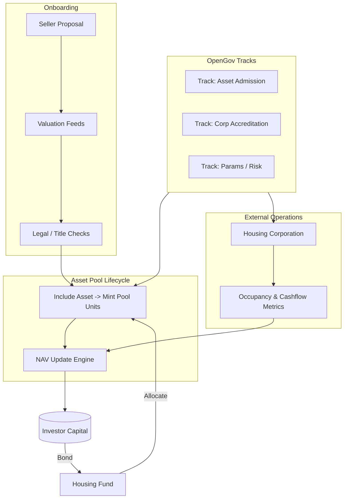

## Challenges Addressed

### Escalating Housing Costs for Tenants

Europe currently observes an all-time high in people facing steep housing costs. In 2021, individuals with incomes below 60% of the median were paying an average of 37.7% towards housing. Significantly, this group also stands at potential risk of poverty.

There's a widening chasm between social housing and the free market, largely driven by profit-oriented market practices, to the detriment of affordable housing. We propose a shift to a socially impactful market instead of one solely profit-driven.

Recent European reports underscore that the persistent issues with social housing remain inadequately addressed (European Pillar of Social Rights Cities Delivering Social Rights, 2020). A concerning 21% of Europeans, approximately 92 million, are potentially facing poverty[^1].

<iframe width="100%" height="800" src="https://ec.europa.eu/eurostat/cache/digpub/housing/vis/02_02_02/index.html?lang=en"></iframe>

[^1]: [Living Conditions in Europe](https://ec.europa.eu/eurostat/statistics-explained/index.php?title=Living_conditions_in_Europe_-_poverty_and_social_exclusion#Key_findings)

### Equity Co-Owners & Investors

For a majority, direct real estate investment remains elusive without middle-men like ETFs or funds. Coupled with the expertise essential for home investment, the current scenario inadvertently propagates inequality[^3]. Fair Squares (FS) seeks to bridge this by fostering collective investment and shared gains.

FS facilitates pooled fractional exposure: properties enter a managed asset pool, and investors hold fungible pool units representing proportional economic exposure. Individual properties are not minted as discrete NFTs; instead, inclusion adjusts pool Net Asset Value (NAV) and may trigger new units minting (additive growth model).

By introducing an innovative, transparent investment approach, Fair Squares aims to address the challenges of affordable housing while catering to the interests of socially conscious investors.

[^3]: [IMF Report](https://www.imf.org/external/pubs/ft/sdn/2015/sdn1513.pdf)

## Fair Squares Unveiled

FS seamlessly bridges home seekers and providers, dismantling financial constraints through co-investment opportunities. By curbing intermediary roles, we significantly trim transaction costs and promote genuine property ownership over mere ROI.

Pooling funds from individual investors, FS purchases and leases properties. The community-driven return on rent (ROR) aims to enable more affordable housing options. FS advocates secure and impactful investment opportunities.

Property ownership under FS relies on consensus by its investors about the intended social returns. These commitments are then anchored and facilitated by the FS platform, aiming to reduce housing expenses.

### Decentralized Governance (OpenGov Tracks)

Governance now leverages Polkadot OpenGov track mechanics. Rather than a static council + investor two‑phase vote, domain‑specific tracks (e.g., Asset Admission, Housing Corporation Accreditation, Parameter Tuning) frame risk and decision latency. Each proposal routes to a track with its own origin, voting curve, and conviction weighting. Track customization lets Fair Squares impose additional safety for high‑impact actions (e.g., adding a new housing corporation) while keeping low‑risk parameter tweaks nimble.

### Asset Verification

The unique challenge for blockchain platforms interacting with tangible assets is ensuring accurate representation. While digital assets might have established evaluation metrics, tangible properties, like real estate, often have subjective valuations. FS aims to devise a reliable valuation mechanism, merging professional expertise with community insights.

### Key Roles within FS

FS envisions a network where registered stakeholders offer services and are remunerated by FS. Given the nature of blockchain disagreements and the need for trust in real-world evaluations, we emphasize the verification of these stakeholders. Their roles span appraisers, inspectors, brokers, and notaries, among others.

### Market Dynamics & External Tenancy Operations

Investors can trade pool exposure (subject to future liquidity mechanisms) without needing per‑property share order books. Tenancy relationships with end users are managed by accredited housing corporations under standardized off‑chain agreements. These corporations feed occupancy and cashflow metrics back to the protocol (or associated indexing layer) enabling transparent NAV evolution while isolating day‑to‑day tenant management from the core chain.

### Key Advantages

Transitioning to a decentralized model offers economical capital access and a tangible solution to pressing socio-economic challenges. Collaboratively, with our FS pilot partners, we aim to redefine housing paradigms. Leveraging blockchain ensures data transparency and accessibility.

**For Investors:**
- Assured social returns via rental or financing agreements.
- Streamlined investment management.
- Fractional ownership of multiple properties.
- Secondary market access for trading property shares.

**For Tenants:**
- Commitment to affordability.
- Stability in leases and protection mechanisms.
- Future prospects of property ownership.

**For Other Stakeholders:**
All stakeholders contribute to FS's evolution. As we craft pilot models for sustainable, legally-compliant platforms, we actively seek collaborations with municipalities and housing associations eager to address housing challenges.

## How Fair Squares Operates

### FS Architecture (Updated Pool & OpenGov)

_Mermaid diagram replaces prior static image – see `technology/architecture.md` for layered variant._

### Funding Framework

Users bond their capital to the housing fund via the platform interface, earmarking it for potential housing investments. This repository holds user-specific stable tokens. The core intent is housing investments, with the transparent, fair allocation of user investments.

### Property Listings

Property listings from homeowners, organizations, and

 real estate agencies are integrated onto the platform. Each listing goes through an extensive verification process, ensuring only genuine, viable properties are available.

### Governance Mechanics

Each governance action specifies its OpenGov track; participation weights conviction and may be subject to bespoke decision curves (e.g., longer enactment for accreditation). Asset inclusion only proceeds after the corresponding track referendum reaches approval; upon enactment the asset pool mints additional units reflecting contributed value subject to acquisition capital allocation.

### Returns & Profit Sharing

Protocol value accrues via net operating income (NOI) data provided by housing corporations. Gross rent, minus agreed service and maintenance costs, flows to the fund; updated NAV implicitly adjusts investor exposure (and potentially informs redemption / issuance curves). Secondary liquidity will reference pool units rather than per‑property slices. Burn events occur only if assets are divested or materially impaired.
