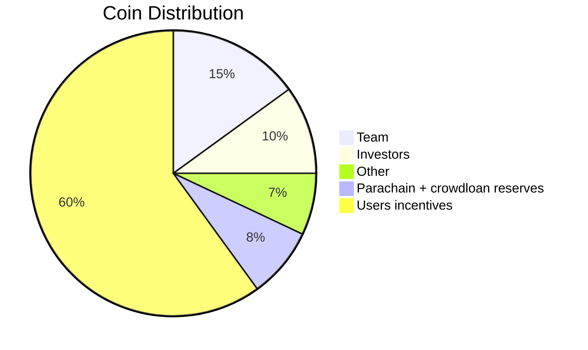

# What is FS ? 

**Fair Squares** connects supply and demand of house-owners & renters and houses & investors. Our motive is that we want to create an more affordable housing market. Investors of the house get a social return while renters can have cheaper housing. We want to remove the financial barrier of investing in real estate for investors that don't have the means to fully invest in a house themselves for a social return. In between the end-users, there is coordination taking place between different stakeholders to achieve the desired outcome. This is where the runtime and the logic of all pallets come together, orchestrating while adhering to strict rules set for an equitable system. The orchestration towards an equitable housing market is configurable and governable by the stakeholders that are concerned with it and are willing to work for it. 

We are zooming much more on the problem definition, stakeholders and the solution in our paper on our [website](https://fair-squares.nl/). To learn more and get in touch with us, please join our [discord channel FS](https://discord.gg/5u3dxE49V5)

Our current development is funded by [Web3 Foundation Grants Program](https://github.com/w3f/Grants-Program)

### How will it work ? 

### How will it be deployed ? 

### What is the roadmap ?

### What is the team ?

### What is the technology stack ?

### What is the business model ?

### What are the token economics ?

### What is the governance ?

### What is the token ?

### What is the token distribution ?

