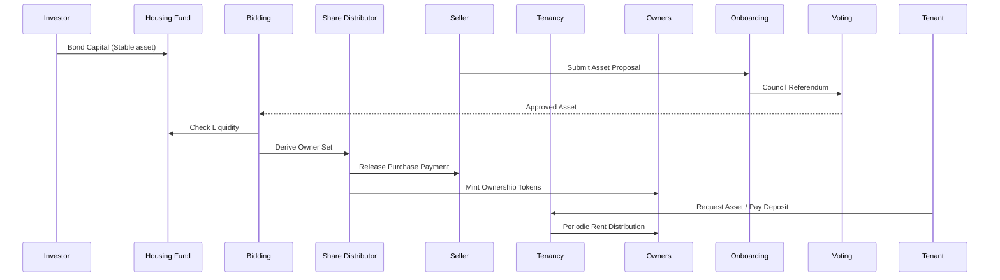

# Fair Squares Protocol Architecture (Layered View)

This page complements the in‑depth pallet walkthrough in `design.md` with higher‑level architectural layers (legal, financial, governance, on‑chain execution) and data flow focus.

## 1. Layer Overview

```mermaid
flowchart TB
  subgraph L0[User & Stakeholder Layer]
    A[Investors]
    B[Tenants]
    C[Sellers]
    D[Notaries]
    E[Representatives]
    F[Servicer / Admin]
  end

  subgraph L1[Governance & Access Layer]
    R[Roles Pallet]\nKYC / Role Registry
    VOT[Voting Pallet]\nCouncil + Investor Voting
  end

  subgraph L2[Asset Lifecycle Layer]
    ONB[Onboarding Pallet]\nProposal Intake
    NFT[NFT Pallet]\nAsset Tokenization
    BID[Bidding Pallet]\nOwner List Derivation
    FIN[Finalizer Pallet]\nOff‑chain Legal Checks
    SHARE[Share Distributor]\nVirtual Account + Ownership Tokens
  end

  subgraph L3[Capital & Tenancy Layer]
    FUND[Housing Fund Pallet]\nCapital Pool
    TEN[Tenancy Pallet]\nLease Flow & Payments
    AM[Asset Mgmt Pallet]\nRep/Tenant Selection + Rent Distribution
  end

  subgraph L4[External / Off-chain]
    LEG[Legal Agreements]\nJurisdictional Docs
    BANK[Stablecoin / Fiat Ramps]
    ORAC[Market / Valuation Inputs]
  end

  A & B & C & D & E & F --> R
  R --> VOT
  R --> ONB
  C --> ONB --> NFT --> VOT
  VOT --> BID --> FIN --> SHARE --> AM
  A --> FUND --> BID
  SHARE --> TEN --> AM
  FIN --> LEG
  FUND --> BANK
  LEG --> TEN
  ORAC --> ONB
```

### Reading The Diagram
- Blue/Green boxes = on‑chain pallets.
- Grey boxes = external dependencies or off‑chain validation domains.
- Horizontal progression = lifecycle from idea → verified asset → fractional ownership → tenancy operations.

## 2. Legal & Compliance Touchpoints

| Phase | Primary Pallet(s) | Legal Concern | Mitigation Pattern |
|-------|-------------------|---------------|--------------------|
| Proposal Intake | Onboarding / NFT | Authentic seller representation | Role verification + proposal fee staking |
| Council Review | Voting | Governance legitimacy | Multi‑role council, recorded decisions |
| Finalization | Finalizer | Title, encumbrances, jurisdiction | Off‑chain notarization checkpoint |
| Ownership Tokenization | Share Distributor | Securities characterization | Fractional utility framing + governance logs |
| Tenancy Activation | Tenancy / Asset Mgmt | Lease enforceability | Hybrid on‑chain record + off‑chain standardized lease |

## 3. Financial Flow (Simplified)



## 4. Data Entities Snapshot

| Entity | Source | Key Fields (Illustrative) | Downstream Usage |
|--------|--------|---------------------------|------------------|
| RoleAccount | Roles | account_id, role, activated | Gating actions (Onboarding, Voting) |
| Proposal | Onboarding | asset_id, price, status, metadata_hash | Voting, Bidding, Finalizer |
| FundContribution | Housing Fund | account_id, amount, age | Bidding ownership algorithm |
| OwnerShare | Share Distributor | asset_id, owner, share_parts | Rent distribution, governance |
| TenantLease | Tenancy | tenant_id, asset_id, rent, remaining_payments | Rent enforcement / Asset Mgmt |

## 5. Replacement of Static Images

Legacy static images (e.g., `bidding_flow.jpg`, `workflow_p1.png`, `workflow_p2.png`) can be progressively refactored into mermaid diagrams using the patterns above. When converting:
1. Identify the semantic stages → prefer `flowchart LR` or `sequenceDiagram`.
2. Keep labels concise – long narrative belongs in surrounding markdown.
3. Use subgraphs to cluster responsibilities (e.g., Council / Investors / System).

## 6. Extensibility Notes
- Additional compliance layers (KYC attestations, property registry oracles) can slot into Layer L4 without changing core pallet contracts.
- Tokenomics or fee redistribution modules would logically extend Layer L3.
- Monitoring / analytics exporters would be adjunct to all layers via event indexing.

## 7. Quick Diff vs `design.md`
`design.md` narrates the chronological scenario with exhaustive role tables. This page instead:
- Normalizes cross‑cutting concerns (legal, financial, governance) into vertical layers.
- Adds a financial sequence view for treasury transparency.
- Introduces an entity portability map for future API / indexer design.

---
_Last updated: 2025-09-29 (update manually when revising)_
