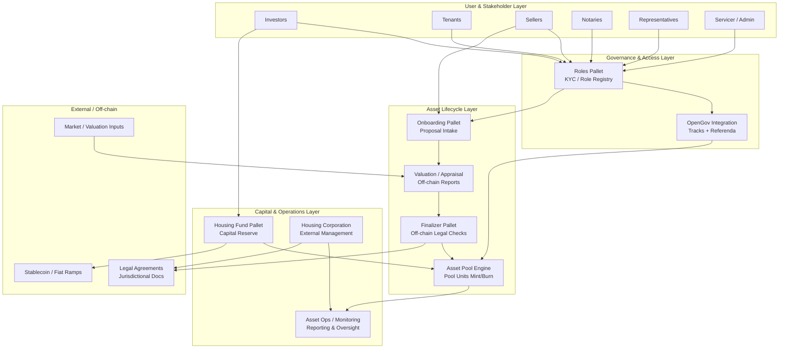
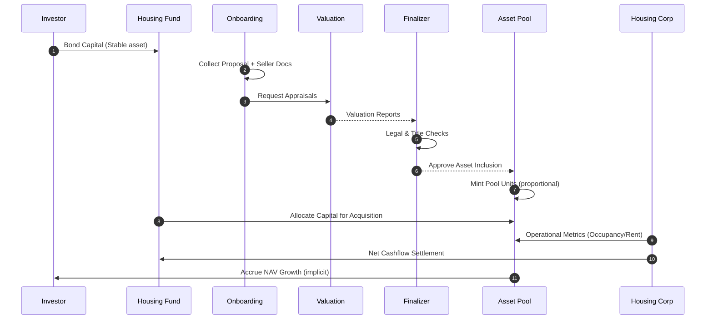

# Fair Squares Protocol Architecture (Layered View)

This page complements the in‑depth pallet walkthrough in `design.md` with higher‑level architectural layers (legal, financial, governance, on‑chain execution) and data flow focus.

## 1. Layer Overview

### Reading The Diagram
- Blue/Green boxes = on‑chain pallets.
- Grey boxes = external dependencies or off‑chain validation domains.
- Horizontal progression = lifecycle from idea → verified asset → pooled backing → external tenancy management.

## 2. Legal & Compliance Touchpoints

| Phase | Primary Pallet(s) | Legal Concern | Mitigation Pattern |
|-------|-------------------|---------------|--------------------|
| Proposal Intake | Onboarding | Authentic seller representation | Role verification + proposal fee staking |
| Valuation | Valuation / Appraisal | Fair market assessment | Multi‑source appraisal + track record |
| Legal Finalization | Finalizer | Title, encumbrances, jurisdiction | Off‑chain notarization checkpoint |
| Pool Expansion | Asset Pool Engine | Asset-to-pool correctness | Mint policy (only additive unless disposal) + audit trail |
| Operational Management | Housing Corporation | Tenant protection, compliance | Regulated third‑party management agreements |

## 3. Financial Flow (Simplified)

## 4. Data Entities Snapshot

| Entity | Source | Key Fields (Illustrative) | Downstream Usage |
|--------|--------|---------------------------|------------------|
| RoleAccount | Roles | account_id, role, activated | Gating actions (Onboarding, Governance) |
| Proposal | Onboarding | proposal_id, asset_metadata_hash, seller_id, status | Valuation, Finalizer |
| Appraisal | Valuation | appraisal_id, proposal_id, value_amount, method, timestamp | Finalizer cross‑checks |
| PoolUnit | Asset Pool | pool_id, total_units, nav_per_unit | Investor dashboards, accounting |
| FundContribution | Housing Fund | account_id, amount, bonded_since | Pool capacity planning |
| GovernanceTrack | OpenGov | track_id, purpose, decision_params | Referendum routing, risk gating |
| CorpAgreement | Off‑chain | corp_id, sla_hash, jurisdictions | Compliance oversight |

## 5. Replacement of Static Images

Legacy static images (e.g., `bidding_flow.jpg`, `workflow_p1.png`, `workflow_p2.png`) can be progressively refactored into mermaid diagrams using the patterns above. When converting:
1. Identify the semantic stages → prefer `flowchart LR` or `sequenceDiagram`.
2. Keep labels concise – long narrative belongs in surrounding markdown.
3. Use subgraphs to cluster responsibilities (e.g., Council / Investors / System).

## 6. Extensibility Notes
- Additional compliance layers (KYC attestations, property registry oracles) can slot into Layer L4 without changing core pallet contracts.
- Tokenomics or fee redistribution modules would logically extend Layer L3.
- Monitoring / analytics exporters would be adjunct to all layers via event indexing.

## 7. Quick Diff vs `design.md`
`design.md` narrates the chronological scenario with exhaustive role tables. This page instead:
- Normalizes cross‑cutting concerns (legal, financial, governance) into vertical layers.
- Adds a financial sequence view for treasury transparency.
- Introduces an entity portability map for future API / indexer design.

---
_Last updated: 2025-09-29 (asset pool + OpenGov + external corp ops refactor)_
