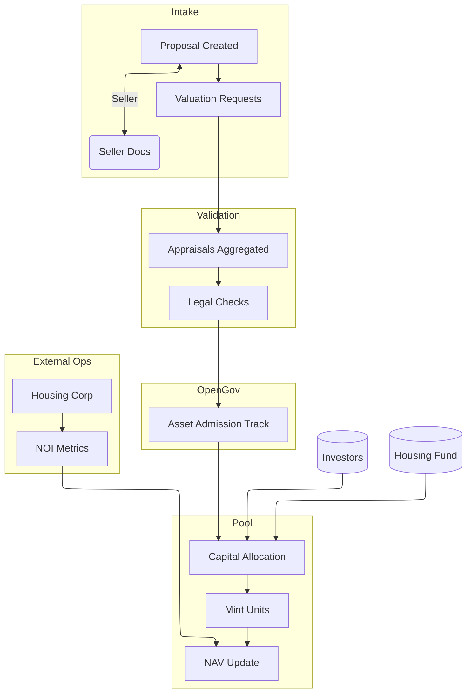
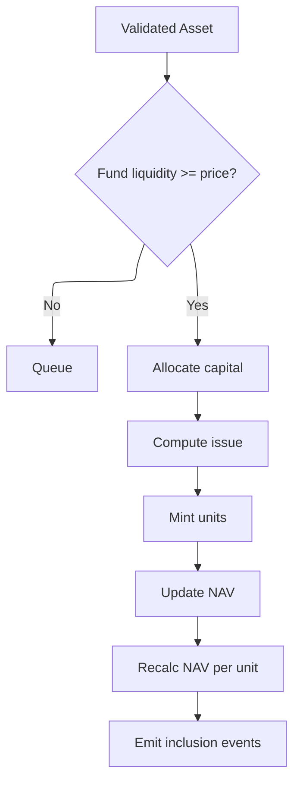
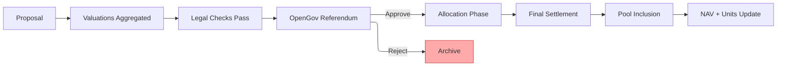
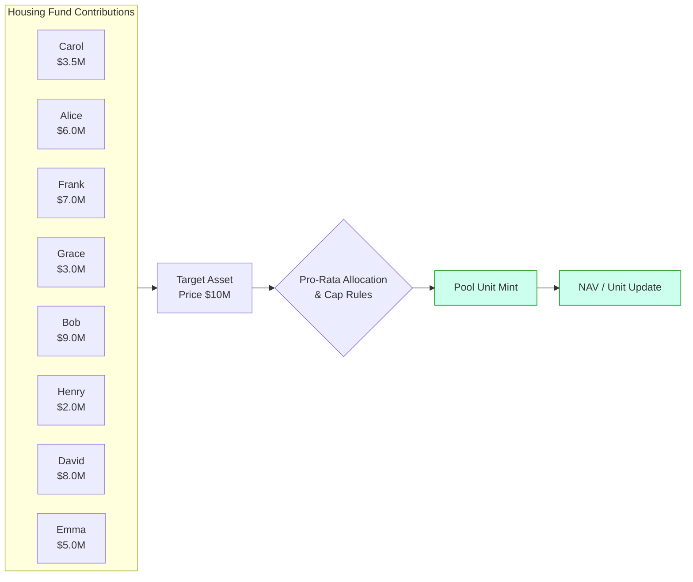
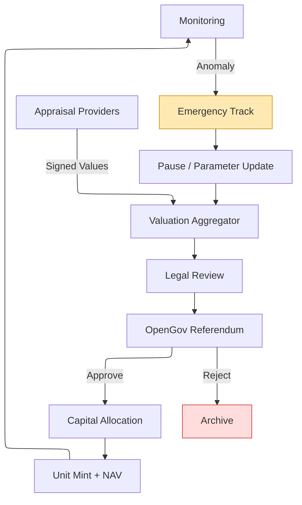

import TOCInline from '@theme/TOCInline';

# Fair Squares Design & Architecture (Updated)

This document supersedes the earlier per‑asset (NFT + Share Distributor + Bidding + Tenancy) model. Assets now enter a pooled structure: investors hold fungible pool units; units are minted when new, validated assets are acquired and burned only on divestment or impairment. Governance migrated to Polkadot OpenGov tracks, and direct tenancy is outsourced to accredited housing corporations.

<TOCInline toc={toc} />

## 1. Role & Actor Overview

On‑chain roles: Servicer, Seller, Notary, Investor. (Representative is legacy, replaced operationally by accredited Housing Corporations.)

Hybrid / off‑chain: Valuation Providers, Housing Corporations, OpenGov Participants (voters / delegates).

## 2. Pallet / Module Set

| Domain | Component | Purpose | Outputs |
|--------|-----------|---------|---------|
| Access | Roles | Identity + role gating | RoleAccount |
| Capital | Housing Fund | Bonded capital accounting | FundContribution |
| Intake | Onboarding | Proposal registry + metadata hash | Proposal states |
| Valuation | Off-chain layer | Aggregated appraisals | Value band data |
| Legal | Finalizer | Title & compliance checks | InclusionApproval / Rejection |
| Pool | Asset Pool Engine | NAV + unit supply mgmt | PoolUnit, nav_per_unit |
| Governance | OpenGov Integration | Track mapping & gating | Referenda outcomes |
| Ops | Monitoring / Metrics | Occupancy & NOI ingestion | MetricReport events |

## 3. High-Level Lifecycle

The end-to-end flow below shows how an asset progresses from proposal intake to pooled NAV impact, and how external operational metrics feed back into valuation updates.

## 4. Capital Allocation & Unit Mint (Diagram)

## 5. Finalization & Governance Confirmation

## 6. Investor Contribution Example (Normalized Names)

## 7. Metrics & Safeguards Overview

